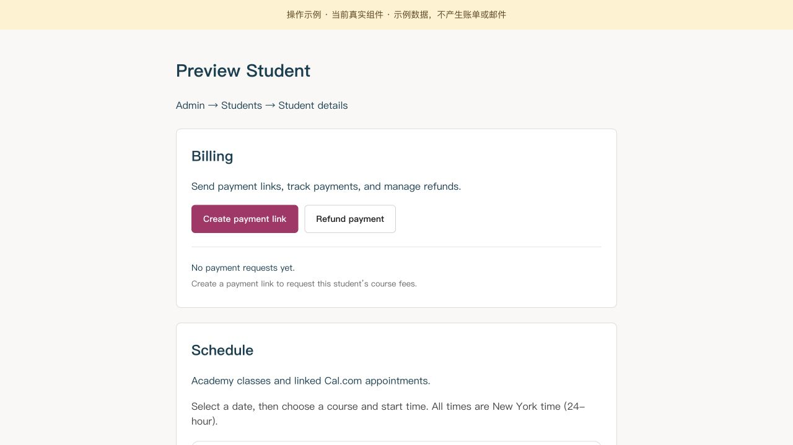
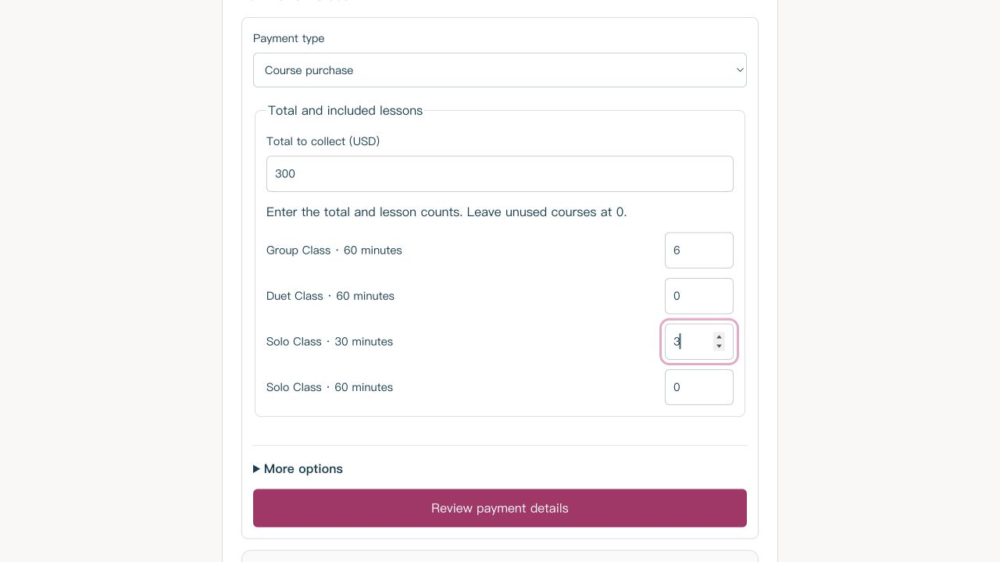
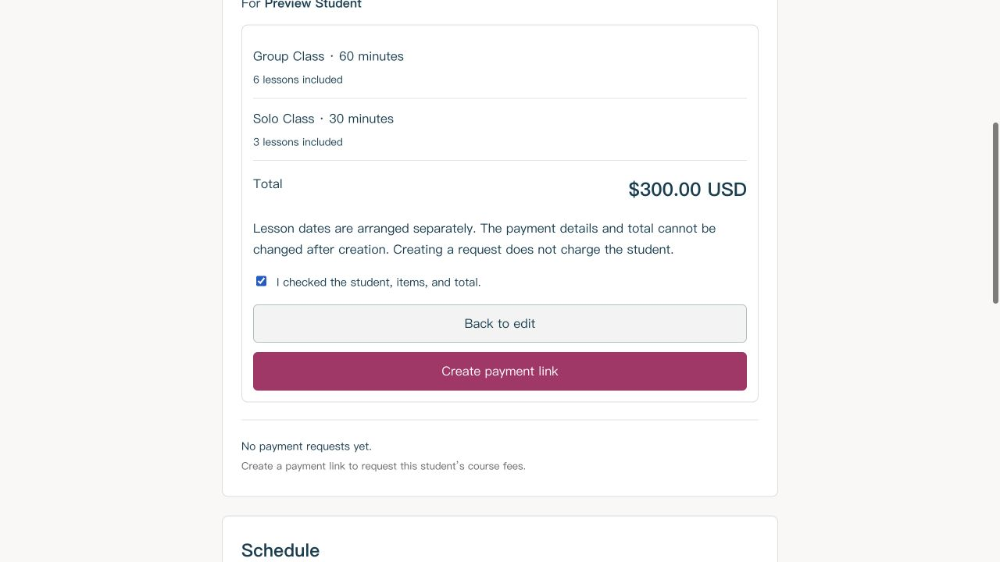
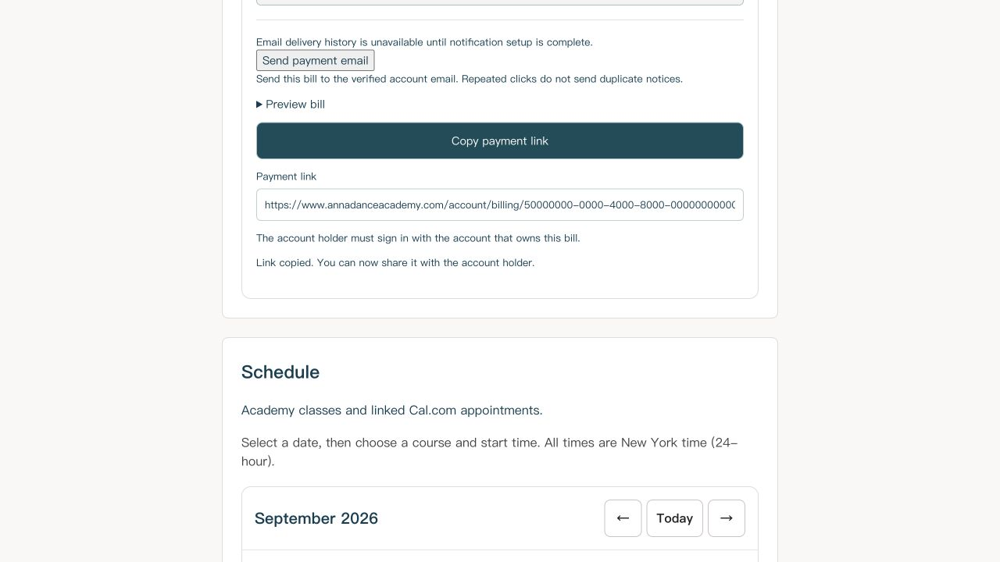
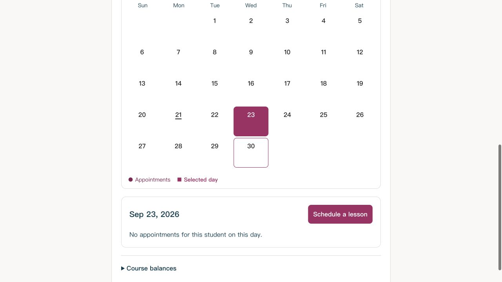
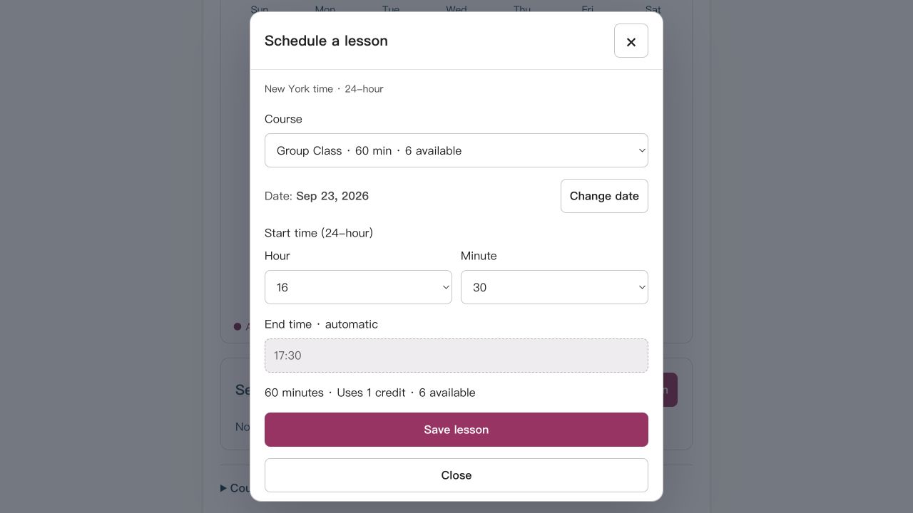
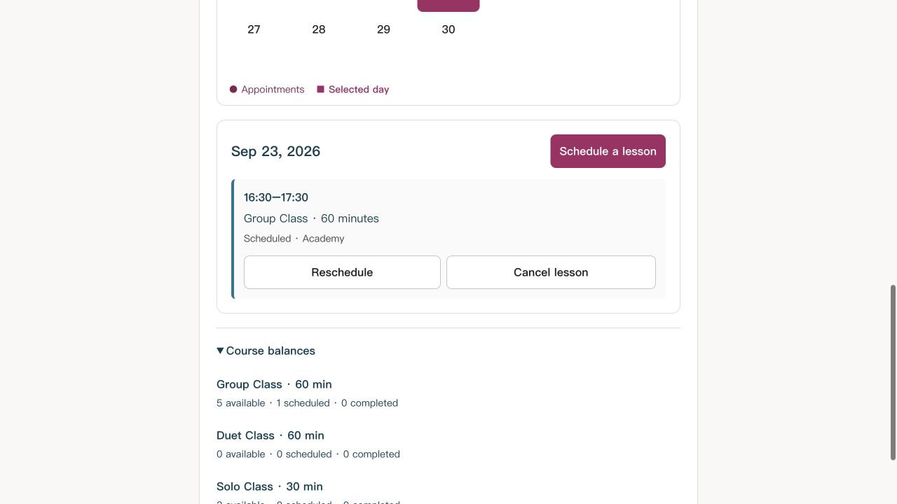
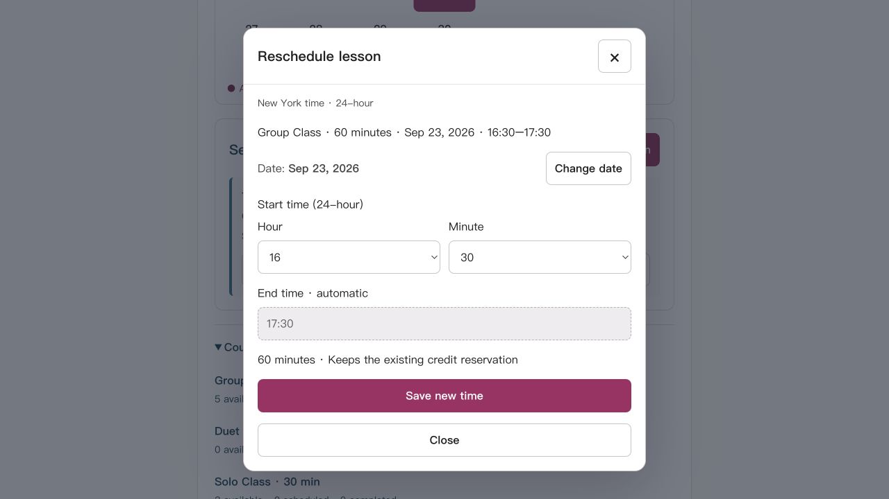
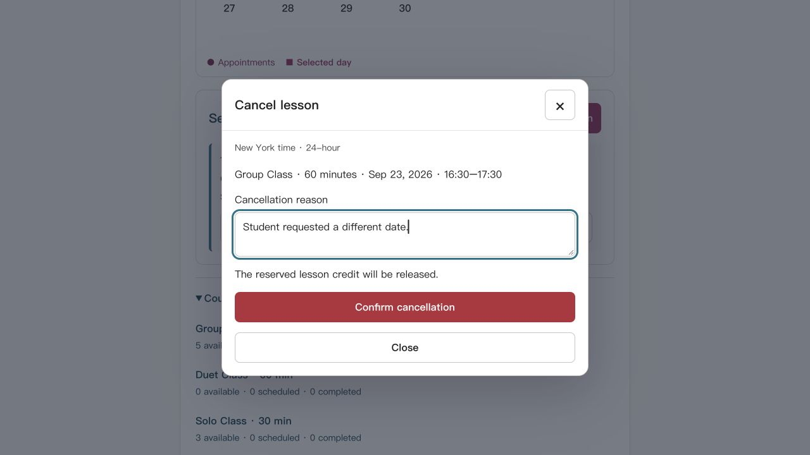

# Admin 图解｜创建付款链接与排课

**选学生 → 创建链接 → 学生付款 → 确认可用课时 → 排课**

> 2026-09-21 版。以下为当前后台组件的示例截图，学生、金额与课时均为演示数据；页面外框为独立演示布局。后台登录尚未完成，非线上操作实录。排课示例使用预先准备的已付款课时，不是新建未付款账单产生的课时。

## 01 · 进入学生，创建链接

登录 [Admin 后台](https://www.annadanceacademy.com/admin) → **Students** → 点击学生姓名 → **Billing → Create payment link**。

## 02 · 填总金额和课程次数

选 **Course purchase**；填写 **Total to collect (USD)** 和各课程次数，不购买的课程保留 **0**，点击 **Review payment details**。

**图中示例：共 $300，含 6 次 Group + 3 次 Solo（30 分钟）；不是学校报价。**

> 营队、活动等不含课时的费用选 **Other fees**。截止日期在 **More options** 中选填。

## 03 · 核对，再创建

核对 **学生、课程、次数、总金额** → 勾选确认 → **Create payment link**。有错点 **Back to edit**。

**创建后金额与明细不能直接修改；创建链接本身不会扣款，也不会自动排课。**

## 04 · 复制或发送链接

点 **Copy payment link**，看到 **Link copied** 后粘贴给该学生；或点 **Send payment email** 发至该账号已验证的邮箱。

**学生须登录账单所属账号付款。** 回到学生页可展开已有账单，再找分享按钮。若显示 **Online payment is not available yet**，需先由负责人确认线上收款配置。

## 05 · 确认课时，选择日期

付款确认后，在 **Schedule → Course balances** 查看 **available**。有可用课时后，点日历日期 → **Schedule a lesson**。

**所有时间均为纽约时间，24 小时制。** 没有可用课时，就不会显示新增排课按钮。

## 06 · 选课程、时间，保存

选 **Course** → 确认日期（**Change date** 可修改）→ 选 **Hour / Minute** → **Save lesson**。

**结束时间自动计算；每次保存安排 1 节课，占用 1 次课时。** 多节课逐次安排；有时间冲突提示时先调整日期或时间。

## 07 · 查看排课结果与余额

保存后点 **Done**，确认当天出现课程卡片；展开 **Course balances** 查看剩余次数。

**available = 可继续排课｜scheduled = 已安排｜completed = 已上完。** 图中 Group 从 6 次可用变为 5 次可用、1 次已安排。

## 08 · 改期

课程卡片点 **Reschedule** → 修改日期或开始时间 → **Save new time**。仍使用原来预留的那 1 次课时。

## 09 · 取消课程

课程卡片点 **Cancel lesson** → 填 **Cancellation reason** → **Confirm cancellation**。该节课预留的课时会释放；取消课程不等于退款。

> 课程结束后，符合条件的 Academy 课程卡片会出现 **Mark completed**，核实已上课再标记。Cal.com 预约需通过对应 Cal.com 流程管理。

---

**转发本指南时，请将此 MD 文件与 `admin-guide-images` 文件夹一起发送，保留相对位置。**
