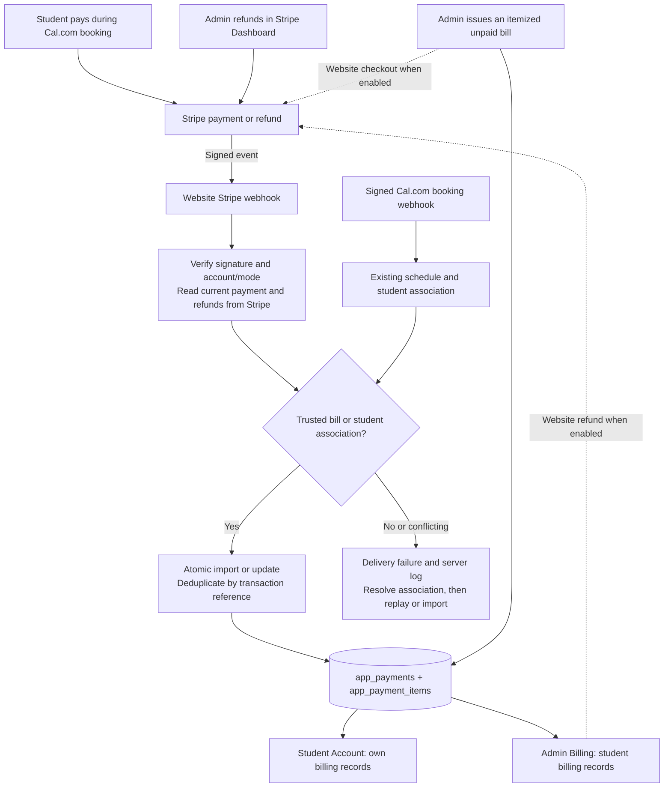
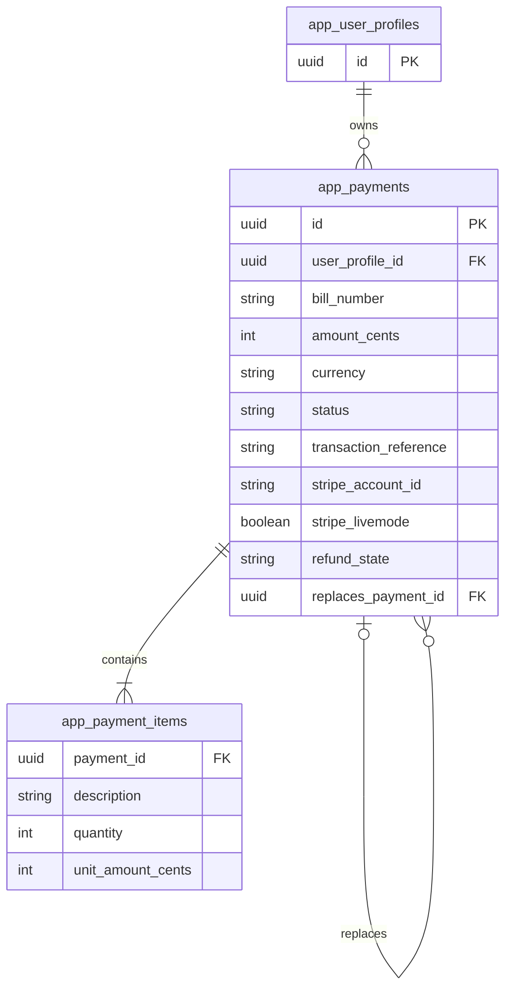

# Payment and Billing Design

September 21 implementation update: see [Registered-account billing MVP](registered-account-billing-mvp.md)
for custom-total bills, notification delivery, local verification, and rollout prerequisites.
The older status tables below describe the September 17 checkpoint.

Updated: September 17, 2026

## Purpose and current status

Billing explains what a student owes and what each charge covers. Payments record money actually collected or returned. Stripe is the authority for Stripe transaction outcomes; the website database is the record used by Student Account and Admin Billing.

The design uses `app_payments` and `app_payment_items`. It does not add invoice, refund, or webhook-event tables. The diagrams describe the deployed integration. Signed live payment reconciliation and duplicate-event handling are verified. Jason's intended full live refund was submitted from Admin and its provider status refreshed successfully on September 17. Independent verification of that refund's webhook delivery, new-booking association, and Student Account acceptance remains pending.

| Capability | Current evidence | Still required |
| --- | --- | --- |
| Itemized bills and shared Account/Admin views | Implemented; base billing UI previously deployed | Student Account acceptance; Admin populated live record passed |
| Stripe synchronization, import, Checkout and refund actions | Deployed; sandbox acceptance and signed live payment replay passed; intended live Admin refund reconciled | Verify new booking association and this live refund's webhook delivery; live Checkout remains disabled |
| Database migrations | Billing and Stripe migrations applied; refund reversal correction applied; imported record reconciled and displayed in Admin | Student Account acceptance |
| Jason's historical USD 0.50 | Original charge retained; full refund `re_3UCoX3DRBUG2kOng0TiLJ5sx` recorded September 17; Admin Stripe refresh retained Fully refunded | Student Account visual acceptance; bank settlement not verified |
| Stripe connection | API and webhook secrets active in Production; Charges and Refunds Write saved; Admin refund initiation enabled | Checkout Sessions permission and live payment enablement remain separate rollout work |
| Hosted Stripe webhook | Active; two genuine payment-event replays returned 200 synchronized with no duplicates | Verify intended refund events and future booking association |
| Lesson-package bills and shareable payment links | Design only; existing itemized-bill and Checkout code can be reused | Implement package review, owner-protected bill page, copy-link controls, and sandbox acceptance |

The current operational checklist is [Stripe payment and full-refund verification](../operations/stripe-payment-refund-testing.md). The owner chose sandbox testing on September 17 to verify payment/refund initiation without a personal credit card. Use the existing Stripe sandbox, an isolated test application and database, and separate webhook credentials. Production reconciliation is active; the owner approved enabling Admin-initiated live full refunds after sandbox acceptance. Earlier progress is preserved in [historical checkpoints](account-billing-20260909-checkpoint.md), whose unchecked items are not the current implementation status.

## Planned lesson-package payment links

The owner requested a design-only extension for collecting several lessons in one payment. See [Lesson Package Bills and Payment Links](lesson-package-payment-links.md) for the interface, flow diagram, data mapping, limits, and implementation checklist. No code or configuration changes are authorized by this design task.

The proposed flow is Admin creates an itemized bill → copies its stable website URL → the owner signs in and reviews course/lesson count/price → Stripe collects the full amount → the signed webhook updates that bill. Lesson count uses the existing item quantity, with an explicit lesson description. No new table is planned. Purchasing lessons does not automatically schedule or track them. Separate guardian access and guest checkout are deferred.

- [x] Document the package flow, lesson-count presentation, existing data mapping, and full-refund boundary.
- [x] Audit existing refund demo/test surfaces before implementation; see the [visibility audit and cleanup checklist](../operations/stripe-payment-refund-testing.md#demo-and-test-surface-audit--before-package-implementation).
- [ ] Complete production demo/test visibility cleanup before the package UI; preserve historical real payments and operational tools.
- [ ] Add package-specific Admin entry/review and Copy payment link / Preview bill controls.
- [ ] Add the owner-protected individual bill page and safe login/Checkout return navigation.
- [ ] Verify one full payment, immutable lesson details, session reuse, wrong-user denial, and full-refund/replacement behavior in sandbox.
- [ ] Review and separately approve any live Checkout permission change and payment-switch enablement; verify the next genuine package payment.

Detailed acceptance cases are maintained in the [package design checklist](lesson-package-payment-links.md#implementation-and-acceptance-checklist).

## System flow

Solid paths show payment/refund result synchronization. Dashed paths initiate new Stripe operations and need additional write permissions. Refunds initiated in Stripe Dashboard still use the same synchronization path. A Cal booking notification establishes schedule identity; it does not establish payment success.

## Separate synchronization from initiating money movement

| Operation | What changes | Stripe access |
| --- | --- | --- |
| Webhook reconciliation or Refresh Stripe status | Update the website from current provider evidence | Webhook signing secret for incoming notifications; API read access to account, payment and refunds |
| Historical import | Add the original verified payment and its itemized description without collecting again | Current importer uses API read access |
| Website Checkout | Create a payment session for a stored unpaid bill | Checkout write access and live initiation enabled |
| Website full refund | Request the return of the original full payment | Refund write access and live initiation enabled |
| Manual recording | Record externally verified money movement in the website only | No Stripe API required; unavailable for provider-managed records |

Synchronization does not require website refund permissions. Start with read-only synchronization if that is the chosen rollout scope. The live key is stored as a Vercel Production Secret. On September 17, after explicit owner approval and identity verification, Charges and Refunds was upgraded from Read to Write for website Admin refunds. Accounts and Payment Intents remain Read; Checkout Sessions remains None. The key retains its original display name, `Anna Dance billing sync - live read only`, although its refund scope now allows writes. Exact restricted-key permissions must be verified against the actual endpoints; Stripe groups Charges and Refunds together.

The current configuration requires both API and webhook secrets even for the existing import/refresh actions. Live initiation uses two independent, default-off switches: `STRIPE_LIVE_PAYMENTS_ENABLED` controls website Checkout and `STRIPE_LIVE_REFUNDS_ENABLED` controls Admin refunds. Both can remain false for reconciliation. Enabling refunds alone does not enable Checkout. Keep secrets server-only. No code may mark Paid simply because a user returns from Checkout.

## Data model and identifiers

- `app_payments` is one issued bill and its single full successful payment, including provider references, payment/refund dates, synchronization state and private audit history.
- `app_payment_items` stores descriptions, quantities and unit prices. Issued items are immutable. Amounts are integer cents and totals must equal their items. Import cannot invent a detailed service breakdown missing from the source; use a verified description and total.
- UUID is the internal bill identity. `bill_number` is a readable display identifier. User ID plus timestamp is not a reliable unique bill identity or an authorization mechanism.
- Store gross customer payment amounts, not Stripe's net payout after processing fees. Different currencies are never summed together.
- No separate invoice document/table is generated. The itemized bill view provides the requested charge explanation; PDF invoicing, taxes, installments and split tenders are outside this release.

## Payment and refund states

| Situation | Bill status | Refund state | Display and balance |
| --- | --- | --- | --- |
| Admin issues a bill | `payment_due` | `none` | Unpaid; included in amount due |
| Payment evidence needs review | `pending_verification` | `none` | Pending verification; not asserted as confirmed debt |
| Full payment verified | `paid` | `none` | Paid; nothing due |
| Full refund requested or processing | `paid` | `requested` / `pending` | Paid with refund processing; not yet Fully refunded |
| Full refund confirmed by Stripe | `refunded` | `succeeded` | Fully refunded; nothing due |
| Refund fails | `paid` | `failed` | Paid with refund failed; requires review |
| Unpaid bill canceled | `cancelled` | `none` | Canceled; nothing due |
| Historical partial refund found | `partially_refunded` | `requires_review` or pending evidence | Preserve actual data and reconcile; no partial-refund initiation |

A newer provider-confirmed failure of the same full refund can correct an earlier success. Preserve the earlier completion observation in audit history. An ordinary old payment-success event must not undo a refund. Request time and the time completion was observed are separate; neither promises a bank-settlement date.

To change the amount of a paid order: refund the original in full, create a separate replacement bill linked by `replaces_payment_id`, and collect a new payment. The replacement does not inherit Paid, and the system does not automatically charge it.

## Event handling, ownership and recovery

The signed endpoint is `/api/integrations/stripe/webhook`. Accepted event types are `payment_intent.succeeded`, `checkout.session.completed`, `checkout.session.async_payment_succeeded`, `charge.refunded`, `refund.created`, `refund.updated`, and `refund.failed`.

1. Verify the raw-body signature, environment and account. Invalid signatures are rejected without updating billing.
2. Read the current PaymentIntent, captured charge and refund history from Stripe. Validate amount, currency, mode, capture and dispute state. Event type alone is not the final state.
3. Match an existing transaction, a server-reserved Checkout bill token, or exactly one signed Cal booking ID plus attendee email and linked student. Historical staff import additionally verifies the selected student against provider payer identity. Never match by name or amount alone.
4. Import/update atomically through the service-only database function. Repeated deliveries/imports reuse the same transaction; row locks and persisted request keys protect concurrent actions.
5. Revalidate Account and Admin views after a successful write. Users see database records on reload; real-time browser push is not implemented.

If a payment arrives before its signed booking or cannot be associated, return a retryable delivery failure and log its event ID. Resolve the association and replay the event or perform verified import. Old unlinked bookings may need their Cal webhook replayed. A successful email receipt is not proof that the website database was updated.

Refresh Stripe status is the current manual recovery action. An ambiguous Checkout/refund response must be reconciled before retrying; the same saved request key is reused. Requests older than the implemented 23-hour safeguard require provider review. A new refund attempt after a provider failure is not created automatically.

A website-wide unmatched-payment inbox, scheduled reconciliation worker, bulk historical backfill, and automated reconciliation for disputes/complex partial refunds remain TODO. These gaps mean webhook retries plus manual review are currently required; do not describe delivery as guaranteed.

## Access and integrity

Students can read only their own billing records and cannot call billing mutation RPCs. Payload administrators initiate manual billing and website refunds through authenticated server actions. The server determines the original amount and account; browser-supplied refund amounts are not authoritative. Audit history and request keys are private.

Once a bill is Stripe-managed or has an active provider request, manual status edits are blocked. A refund button click is not completion. Empty billing activity and a database load failure remain separate UI states. Current term stays hidden.

## Rollout and acceptance

- [x] Define the two-table model, full-refund policy, ownership checks and atomic updates.
- [x] Implement local provider synchronization, historical import, reconciliation and optional initiation paths; validate focused tests and disposable database assertions.
- [x] Apply forward database migrations and verify private RPC access boundaries.
- [x] Locate Jason's original successful USD 0.50 payment in the live Dashboard.
- [x] Configure the read-only live API key and webhook signing secret; hosted reconciliation verified account and API access.
- [x] Import Jason's original transaction using current authenticated Dashboard evidence; preserve gross amount, original charge timestamp, booking reference and verification provenance. The existing transaction-deduplicating database function was used; no new Stripe charge was made.
- [x] Read the saved record through the same database fields used by the billing UI: one bill, one item, USD 0.50 Paid, zero due, summary All paid.
- [x] Verify Jason's populated production Admin page while signed in: All paid, USD 0.50 Paid, USD 0.00 due, original payment date and reference; Refresh Stripe status succeeds.
- [ ] Verify Jason's Student Account page while signed in as the student.
- [x] Clarify and visually verify the refund-unavailable message when Stripe is connected and website initiation is disabled; administrators can refund in Stripe and refresh.
- [x] Deploy the route and verify signed Stripe delivery: two replays of Jason's existing payment event returned 200, retaining one bill and one item. See the operational guide for IDs and timestamps.
- [x] Verify isolated sandbox Checkout, declined-card recovery, Admin and Dashboard full refunds, pending-to-success and success-to-failure notifications, concurrent-request deduplication, and student database isolation. Three USD 0.50 test payments were used; all genuine deliveries returned 200. See the operational guide for evidence and remaining limits.
- [x] Fix the Account CSS Modules compilation error found during verification; preserve mobile behavior by moving page-wide rules to global CSS.
- [ ] Verify automatic association for the next genuine Cal payment and recovery when payment arrives before the booking.
- [x] Separate the live Admin refund switch from website Checkout; preserve default-off behavior and account/mode checks.
- [x] Enable the requested production Admin refund flow: save approved Charges and Refunds Write, deploy the independent refund gate, and set `STRIPE_LIVE_REFUNDS_ENABLED=true` while retaining `STRIPE_LIVE_PAYMENTS_ENABLED=false`. Production Admin refund review passed.
- [x] Complete Jason's intended USD 0.50 full refund from Admin; verify Fully refunded and the refund reference after a successful Refresh Stripe status action. See the operational evidence.
- [ ] Independently verify this live refund's signed delivery and final Student Account state; Admin/provider reconciliation passed.
- [ ] Verify both authenticated UI views, wrong-user denial, error recovery and repeated notification handling with the deployed integration.

Follow the detailed [operational checklist](../operations/stripe-payment-refund-testing.md) for sandbox setup and acceptance evidence. Complete payment/refund initiation tests in the isolated sandbox before deciding on live website initiation. Do not manufacture live purchases for testing. Do not run `pnpm build`. Passing local checks, a database migration or a visible refund button does not mean the live integration is complete.

## Implementation map

| Responsibility | Files |
| --- | --- |
| Bill model, totals and presentation states | `src/lib/billing/model.ts`, `src/lib/billing/load.ts` |
| Provider environment and transaction evidence | `src/lib/stripe/config.ts`, `src/lib/stripe/snapshot.ts` |
| Import, synchronization, Checkout and refund service | `src/lib/stripe/billing.ts` |
| Authenticated Stripe actions | `src/actions/stripe-billing.ts` |
| Signed Stripe notifications | `src/app/(frontend)/api/integrations/stripe/webhook/route.ts` |
| Signed Cal booking identity | `src/lib/cal/booking-sync.ts`, `src/app/(frontend)/api/integrations/cal/webhook/route.ts` |
| Account/Admin billing and refund controls | `src/components/billing-records.tsx`, `billing-admin.tsx`, `billing-refund.tsx`, `stripe-billing-controls.tsx` |
| Database changes | `supabase/migrations/20260909190000_add_itemized_billing.sql`, `20260910180000_connect_stripe_billing.sql`, `20260910193000_handle_stripe_refund_reversals.sql` |
| Verification | `tests/int/billing*.int.spec.ts`, `tests/int/stripe*.int.spec.ts`, `tests/fixtures/stripe-billing-database.sql` |
