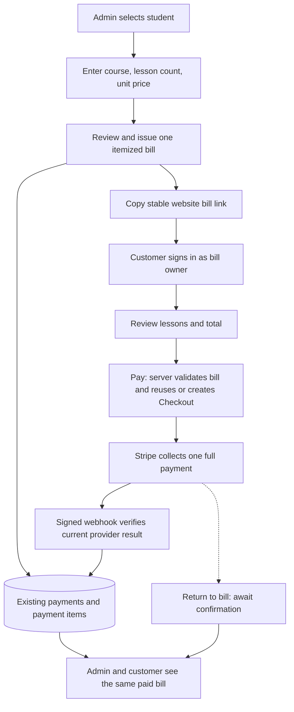

# Lesson Package Bills and Payment Links

> September 21 course-credit extension: a new locally implemented mode uses one negotiated total with separate included-course counts. See the [course-credit checklist](stripe-course-credits-checklist-20260921.md) and [local acceptance/rollout limits](../operations/course-credits-local-acceptance-20260921.md). The earlier modes and evidence below remain historical context.

Updated: September 21, 2026

Status: Implemented locally and included in commit `06b6cd5`. The owner authorized implementation after the original design. A 10 × $30 package completed sandbox Checkout, signed webhook synchronization, and Admin full refund. Production migration/deployment are documented in the September 21 release checkpoint; live Checkout enablement remains unverified. See [package acceptance evidence](../operations/package-payment-acceptance.md). The September 21 [registered-account billing MVP](registered-account-billing-mvp.md) extends this flow with custom totals, acknowledgement, and email notifications; its consented customer sandbox payment/refund and branded email flow passed at 13:26–13:28 PDT. Concurrent-webhook retry and live configuration remain open; see the [current release checkpoint](../operations/billing-release-acceptance-20260921.md).

Related: [Payment and Billing Design](account-billing.md) · [Stripe operations and acceptance](../operations/stripe-payment-refund-testing.md)

## Outcome and scope

An administrator can issue one bill for several lessons, copy its payment link, and share it with the intended account holder. The customer sees the course, exact number of lessons, price per lesson, and total before making one payment. Verified payment updates the same bill in Admin and Student Account.

This purchases a stated number of lessons. It does not create bookings, assign a class, or track attendance or remaining lesson credits. Staff continue to arrange the schedule separately. Cal.com appointment payments keep their existing flow.

### First-release decisions

- Use the existing `app_payments` and `app_payment_items` model. No new invoice, package, payment-link, or refund table is planned.
- One bill belongs to one existing student account and accepts one full payment in USD. A bill can contain multiple itemized course lines.
- Copy a stable website bill URL, not a reusable generic Stripe product link. A temporary Stripe Checkout Session is obtained when the authenticated owner clicks Pay.
- Require the bill owner's existing login. This release does not introduce guest checkout or new parent/guardian access. A parent can use an already established account that owns the bill; a separate guardian login requires its own access design.
- The Lesson package option uses lesson count × price per lesson. The September 21 Custom total option stores one exact charge with lesson/day count and coverage in its description; see the registered-account MVP. Coupons, installments, subscriptions, and automatic future charges remain deferred.
- Keep issued descriptions, quantities, and amounts immutable. Full refunds follow the existing policy; a replacement bill requires a separate payment.
- **Copy payment link** remains available. The September 21 MVP also adds **Send payment email** and payment confirmations; provider delivery acceptance is still pending. SMS and recurring reminders remain deferred.

## Administrator flow

Location: **Admin → Student → Billing → Create bill → Lesson package**. Keep the existing general itemized-bill option available; do not relabel every quantity as lessons.

| Field | Example | Rule |
| --- | --- | --- |
| Student | Jason | Taken from the selected student; show prominently during review |
| Course / package name | Ballet — Fall 2026 | Required; stored as an immutable charge description |
| Number of lessons | 10 | Required integer, 1–100, following the existing quantity limit |
| Price per lesson (USD) | 30.00 | Required positive amount in cents for a payable package |
| Line total | 300.00 | Calculated, not independently editable |
| Due date | Optional | Informational due date; does not silently expire the bill |

1. Enter one or more course lines. The form remains an unsaved local draft; no Draft database status is introduced.
2. Select **Review bill**. Show the student, all courses, lesson counts, unit prices, total, and due date. Explain that issuing locks the charges.
3. Confirm **Create bill** once. Persist the bill and its items atomically. Existing bill identity must make retries safe; do not create a second bill after an uncertain response without checking the first.
4. Show **Bill created**, the unpaid record, **Preview bill**, and **Copy payment link**. Copy only after the saved identity is confirmed.
5. After copying, show **Link copied**. If clipboard access fails, show a selectable URL. Do not claim the link was sent or delivered.

When online collection is disabled, creation of an ordinary unpaid bill may remain available, but do not present a usable **Copy payment link** action. Show **Online payment is not available yet**. Existing shared URLs must also display that state if collection is later disabled.

### Example review and payment summary

> **Ballet — Fall 2026**
>
> For Jason · **10 lessons**
>
> $30.00 per lesson × 10
>
> **Total: $300.00 USD**
>
> One payment covers the 10 lessons listed above. Lesson dates are arranged separately.
>
> **Pay $300.00**

For multiple courses, show the lesson count on each course line. Do not combine different courses into an unexplained single quantity. All examples are illustrative, not published academy prices or refund eligibility promises.

## Customer flow and link behavior

Implemented path: `/account/billing/[billId]` on the configured website origin.

1. The recipient opens the website link. An unauthenticated visitor signs in and returns to that bill, using a validated same-site return path.
2. The server loads the bill only for the authenticated owner. The UUID locates the bill; it does not grant access. Unknown and wrong-owner references receive a generic unavailable result without student or payment details.
3. The page shows the stored course description, **number of lessons**, per-lesson price, total, due date, and actual billing status. The customer cannot edit the lesson count or price.
4. **Pay $300.00** asks the server to obtain Checkout for that stored unpaid bill. Merely viewing, previewing, or copying a link must not create a Checkout Session or request payment.
5. Stripe Checkout shows the same lesson description, fixed quantity, unit price, currency, and total. The server supplies all amounts and the trusted bill reference. Do not add adjustable quantities or accept prices from the browser.
6. Return to the same bill after completing or closing Checkout. The return URL is navigation, not proof of payment. Show **Payment submitted — awaiting confirmation** when appropriate; never encourage a second payment while the first needs verification.
7. The signed webhook reconciles provider evidence into the existing bill. Reloading the bill then shows Paid in both customer and Admin views. An automatic live page update is not assumed; include a refresh/recheck state in the UI design.

The website URL remains the stable reference. Stripe Checkout Sessions expire, so the website must retrieve/reuse an open session or replace one only after confirmed expiration. Stripe currently allows a Session lifetime of 30 minutes to 24 hours, defaulting to 24 hours. See [Create a Checkout Session](https://docs.stripe.com/api/checkout/sessions/create).

## Data mapping and price rules

| Value | Existing storage or behavior |
| --- | --- |
| Student owner, bill identity, status, total, due date | `app_payments` |
| Course and billing-period snapshot | `app_payment_items.description` |
| Purchased lesson count | `app_payment_items.quantity` |
| Price per lesson in integer cents | `app_payment_items.unit_amount_cents` |
| Checkout identity, request key, payment/refund references | Existing Stripe fields on `app_payments` |
| Shareable URL | Derived from configured origin and bill ID; no stored public access token |

For lesson-package lines, construct an explicit description such as `Ballet — Fall 2026 (10 lessons)`, with quantity `10` and unit amount `3000`. The reviewed name and lesson count must agree; do not silently truncate the final description beyond the existing 200-character limit. The website can render the stored item generically as description plus quantity × unit price, while still clearly exposing the number of lessons. Historical non-lesson items retain generic quantity labels; do not parse their descriptions into new lesson entitlements.

The server recalculates the total from stored integer-cent values and requires it to match the bill. Ten lessons at $30.00 produces $300.00. A three-lesson package advertised as exactly $100.00 cannot be represented by rounding a per-lesson price: that would change the charge. Use the separately implemented Custom total option for that case: it stores one charge and puts the lesson count in the description, without inventing a rounded per-lesson rate. Existing validation and line-count limits still apply.

Package issuance requires `20260917200000_issue_package_bills.sql`: a service-only, retry-safe `app_issue_bill` function, using a transaction lock and immutable payload comparison. It adds no financial tables. The September 21 notification/acknowledgement extension additionally requires `20260921200000_billing_notifications.sql`; deploy both before the combined code. Both were subsequently applied in the [September 21 production rollout](../operations/billing-production-migration-20260921.md). Do not reapply the non-idempotent migrations.

## Status, retry, and refund behavior

| Situation | Customer/Admin behavior |
| --- | --- |
| Unpaid, no unresolved payment | Show the bill and Pay action when online collection is enabled |
| Open Checkout already exists | Reuse that session; concurrent clicks must not create duplicate sessions |
| Checkout expired | Verify expiration before obtaining a replacement session for the same unpaid bill |
| Checkout completed, result not reconciled | Show payment confirmation pending; no new payment request |
| Card declined or customer closes Checkout | Do not mark Paid or cancel the bill; allow the existing verified retry flow |
| Unknown provider result or stale request key | Require reconciliation; retain the existing 23-hour safeguard against blindly recreating an unknown request |
| Paid | Show Paid and original lesson details; remove the Pay action |
| Full refund processing | Show refund processing; no replacement charge or new Pay action |
| Fully refunded | Show refunded amount and original purchased lessons as history; old link cannot collect again |
| Cancelled | Show Cancelled; no Pay action |
| Overdue but still unpaid | Show overdue status without inventing fees or changing lesson quantity |
| Wrong account or missing bill | Generic unavailable result; no billing information revealed |

Before issuance, staff may edit freely. An issued bill with an error must be cancelled and replaced only when cancellation is safe. Existing provider-managed bills block manual status edits; this design does not promise new cancellation support for an active or unresolved Checkout. Staff must reconcile provider state first. An incomplete payment or session must not remain payable behind a cancelled website record.

After a completed payment, retain the agreed policy: refund the full original amount, then issue a separate replacement bill for revised content. Link it using the existing replacement mechanism; it starts unpaid. This bill is a charge record, not a remaining-lessons balance, and refunding does not automatically change the schedule.

## Implementation and rollout boundary

Admin package review, copy/preview controls, the owner-protected bill page, per-bill return paths, and immutable stored-item Checkout are implemented. Open-session reuse, verified expiration, stale-request blocking, and completed-before-webhook handling are covered by service tests. Sandbox payment/refund delivery and preserved quantities are recorded in the acceptance evidence.

Admin opens Checkout only for staff sandbox testing; customer Checkout uses the authenticated owner. Copying a link does not authorize staff to pay on a customer's behalf.

The last verified live setup had Checkout Sessions permission set to None and `STRIPE_LIVE_PAYMENTS_ENABLED=false`, with refunds enabled independently. Recheck the actual live configuration before rollout. The successful package test used the sandbox's existing Checkout permission; no live key or switch was changed.

## Implementation and acceptance checklist

### Design completed in this document

- [x] Specify one payment for itemized lesson packages and exact lesson-count presentation.
- [x] Reuse the two existing tables and ownership model; define no new public access token.
- [x] Define the stable website link, authenticated payment flow, and distinct Stripe Session lifetime.
- [x] Document full refunds, replacements, pricing limits, parent-account limits, and scheduling boundaries.

### Phase 1 — Admin and customer interface

The demo/test visibility cleanup is implemented and covered locally. Production deployment verification remains a release task. Checked items below describe code/local verification, not production availability.

- [x] Hide production refund demos and remove testing wording from live payment tools; preserve sandbox coverage, real transaction records, and operational import/refresh/refund controls.

- [x] Add the lesson-package option without changing generic item quantity semantics.
- [x] Add review-before-issue with student, course, lesson count, unit price, total, due date, and immutable-charge notice.
- [x] Return the confirmed saved bill identity and expose Preview bill / Copy payment link with clipboard fallback.
- [x] Add the owner-protected individual bill page and safe login return path; deny other users without disclosure.
- [x] Clearly display course and lesson count on every payment and historical bill view; lock quantities and prices at payment time.
- [x] Add disabled-collection, unpaid, pending confirmation, paid, refunded, cancelled, missing, and error states.

### Phase 2 — Payment integration

- [x] Reuse the existing stored-bill Checkout path and trusted metadata; update success/cancel navigation to the individual bill.
- [x] Confirm session reuse/expiration behavior and prevent duplicate issuance or collection on repeated clicks, retries, or tabs.
- [x] Revalidate the new bill route after payment/refund reconciliation as well as Account and Admin.
- [x] Preserve purchased lesson descriptions and quantities through webhook updates and full refunds.
- [x] Verify paid, refunded, cancelled, completed-but-unverified, and wrong-owner bills cannot obtain a fresh payable session.

### Phase 3 — Sandbox acceptance

- [x] Create a synthetic 10 × $30 bill; verify course, 10 lessons, $30 unit price, and $300 total in Admin, website bill, and Stripe Checkout.
- [ ] Verify multi-course lines, lesson-count validation, integer-cent totals, and rejection of an unsupported fixed-total rounding shortcut.
- [x] Verify copied links and clipboard failure fallback; owner filtering and cross-account 404; customer bill at 390px and 1280px.
- [x] Verify signed-out bill navigation preserves the bill URL in the login destination.
- [x] Complete login return and bill acknowledgement after explicit user acceptance of the mandatory Terms checkbox; verify teacher-note persistence.
- [ ] Complete full keyboard-only package issuance review.
- [x] Pay once in sandbox and prove webhook-driven update of the same bill without manual Paid or Refresh Stripe status actions; capture delivery evidence and item preservation.
- [x] Verify declined payment, close/reopen Checkout and two-tab reuse of one open session on the USD 3.01 customer sandbox bill.
- [ ] Exercise delayed webhook, provider-managed retry, expired session, stale request and remaining out-of-order scenarios. Concurrent events still produced some 503 responses; see the release checkpoint.
- [x] Perform a sandbox full refund; verify the old link remains historical with no Pay action and intact lesson details.
- [ ] Complete package-specific replacement-bill browser acceptance through its separate payment.
- [x] Run focused tests, type checks, and in-app desktop/mobile verification; do not run `pnpm build`.

### Phase 4 — Controlled release

- [x] Obtain implementation authorization (owner request following the design).
- [x] Apply required migrations and verify deployed billing UI in the September 21 production rollout. Later local template changes still require their own deployment.
- [ ] Verify the intended merchant/mode and minimum required Checkout permissions in sandbox, then obtain the required live permission approval.
- [ ] Enable the independent live payment switch only for the approved rollout; retain existing refund behavior.
- [ ] Verify the deployed page and payment-link controls using non-financial viewing/copy actions.
- [ ] Observe the next genuine package payment and signed delivery; confirm identical lesson details in Account/Admin and receipt delivery where applicable. Do not create an artificial live purchase solely for acceptance.

## Deferred work

Guest payment links; separate parent/guardian permissions; registration before account creation; class capacity and enrollment; scheduling; attendance and remaining credits; coupons; subscriptions/installments; automatic reminders; SMS delivery; downloadable invoice PDFs; reusable package catalogs. These require their own scope rather than being implied by a paid bill.

## Source map

- Existing behavior: `src/components/billing-admin.tsx`, `src/components/billing-records.tsx`, `src/components/stripe-billing-controls.tsx`, `src/actions/billing.ts`, `src/actions/stripe-billing.ts`, `src/lib/billing/model.ts`, `src/lib/billing/load.ts`, `src/lib/stripe/billing.ts`.
- Data integrity: existing billing and Stripe migrations under `supabase/migrations/`.
- Stripe fields and session expiration: [Create a Checkout Session](https://docs.stripe.com/api/checkout/sessions/create), checked September 17, 2026. Provider capabilities do not establish production rollout or acceptance.
